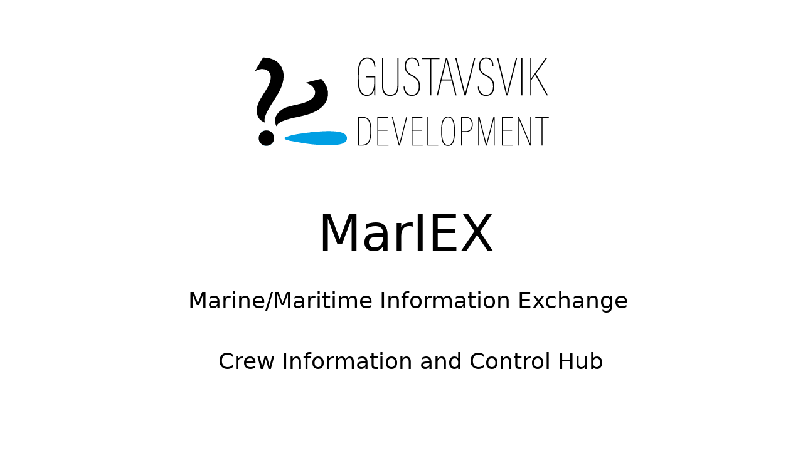

# wagger
<!--  -->
Front-end part of project aimed at creating a general back-to-front solution for hosting, initialization, configuration and data acquisition from wired and wireless nodes and gateways, local data storage, on-demand cloud host data replication and streaming to a basic browser view and control interface.
<!-- blank line -->
<figure class="video_container">
  <iframe src="https://drive.google.com/open?id=1D-FsUaLIGC_kvwJi002GezC3-dXiR3s_" frameborder="0" allowfullscreen="true"> </iframe>
</figure>
<!-- blank line -->

<dl>
  <!-- <dt>Definition list</dt> -->
  <!-- <dd>Is something people use sometimes.</dd> -->
  <!-- <dt>Markdown in HTML</dt> -->
  <!-- <dd>Use HTML <em>tags</em>.</dd> -->
</dl>
